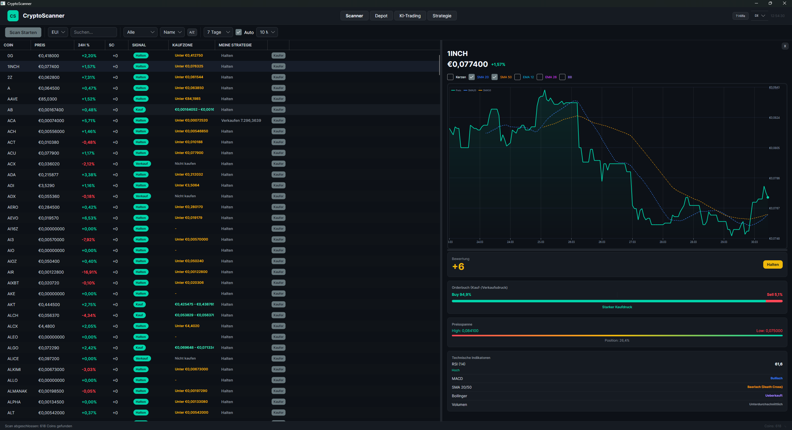
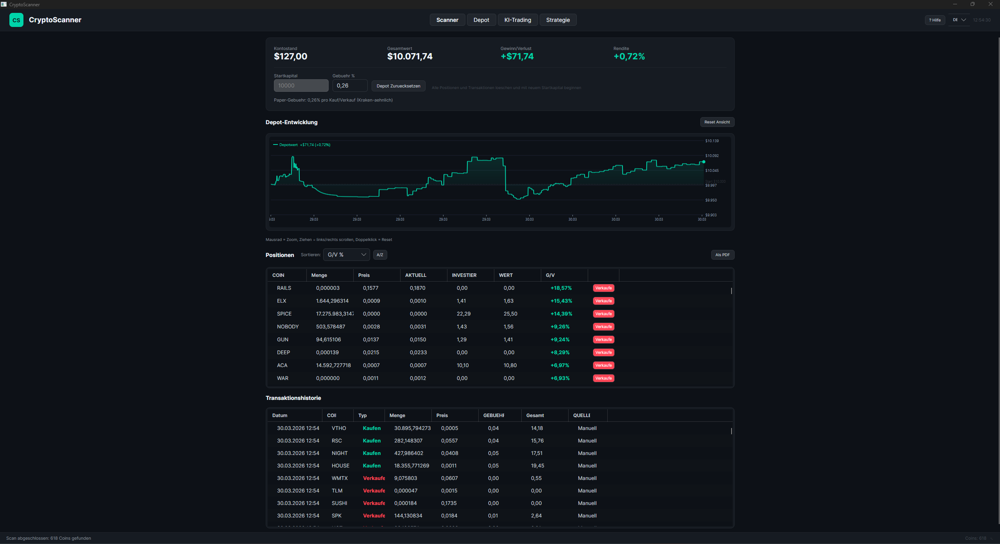
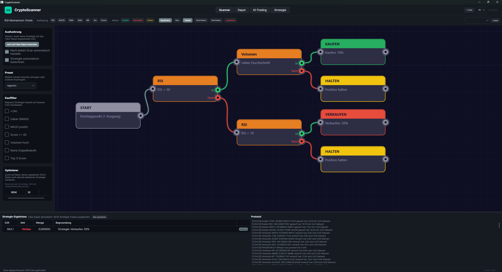

# CryptoScanner

## English

Desktop app for crypto analysis, scanner signals, paper trading, strategy building, and AI-assisted workflows built with Avalonia UI and .NET 8.

> Not financial advice. This project is for information, learning, and testing only.

### Features

- Real-time market data via the Kraken public API without a private API key
- Technical analysis with RSI, MACD, SMA, EMA, Bollinger Bands, and volume
- Composite score with buy, hold, and sell signals
- Paper trading portfolio with fees, history, and portfolio performance
- Visual strategy editor with testing, optimization, and paper portfolio execution
- User interface with German/English language switching

### Screenshots

Scanner and detail view:



Portfolio and transaction history:



Strategy builder:



### Platforms

- Windows
- Linux
- macOS

### Requirements

- [.NET 8 SDK](https://dotnet.microsoft.com/download/dotnet/8.0)

### Linux dependencies

```bash
# Ubuntu / Debian
sudo apt-get install -y libx11-dev libice-dev libsm-dev libfontconfig1-dev

# Fedora
sudo dnf install libX11-devel libICE-devel libSM-devel fontconfig-devel
```

### Run locally

```bash
cd CryptoScanner
dotnet restore
dotnet build
dotnet run --project CryptoScanner
```

### Release builds

Manual publish examples:

```bash
# Windows
dotnet publish CryptoScanner/CryptoScanner.csproj -c Release -r win-x64 --self-contained

# Linux
dotnet publish CryptoScanner/CryptoScanner.csproj -c Release -r linux-x64 --self-contained

# macOS Intel
dotnet publish CryptoScanner/CryptoScanner.csproj -c Release -r osx-x64 --self-contained

# macOS Apple Silicon
dotnet publish CryptoScanner/CryptoScanner.csproj -c Release -r osx-arm64 --self-contained
```

Automated GitHub releases:

- A git tag like `v1.0.0` triggers the GitHub Actions workflow
- Release artifacts are built for Windows, Linux, and macOS
- The generated files are attached automatically to the GitHub Release

### Quick start

1. Start a scan and load coins.
2. Select a coin and inspect the chart plus indicators.
3. Optionally use the paper portfolio or strategy tab.

### Project structure

```text
CryptoScanner/
├── .github/workflows/
├── CryptoScanner.sln
├── README.md
└── CryptoScanner/
    ├── Assets/
    ├── Models/
    ├── Services/
    ├── ViewModels/
    └── Views/
```

### Tech stack

- Avalonia UI 11
- .NET 8
- MVVM with CommunityToolkit.Mvvm
- Kraken public market data

### License

This project is licensed under the GNU GPL v3.0.

---

## Deutsch

Desktop-Tool fuer Krypto-Analyse, Scanner-Signale, Paper-Trading, Strategie-Builder und KI-Unterstuetzung auf Basis von Avalonia UI und .NET 8.

> Keine Anlageberatung. Dieses Projekt dient nur zu Informations-, Lern- und Testzwecken.

### Funktionen

- Echtzeit-Marktdaten ueber die Kraken Public API ohne privaten API-Key
- Technische Analyse mit RSI, MACD, SMA, EMA, Bollinger-Baendern und Volumen
- Composite-Score mit Kauf-, Halten- und Verkaufssignalen
- Paper-Trading-Depot mit Gebuehren, Historie und Depotentwicklung
- Visueller Strategie-Editor mit Testen, Optimieren und Fake-Depot-Ausfuehrung
- Benutzeroberflaeche mit Deutsch/Englisch-Umschaltung

### Screenshots

Scanner mit Detailansicht:


Depot mit Verlauf und Historie:


Strategie-Editor:


### Plattformen

- Windows
- Linux
- macOS

### Voraussetzungen

- [.NET 8 SDK](https://dotnet.microsoft.com/download/dotnet/8.0)

### Linux-Abhaengigkeiten

```bash
# Ubuntu / Debian
sudo apt-get install -y libx11-dev libice-dev libsm-dev libfontconfig1-dev

# Fedora
sudo dnf install libX11-devel libICE-devel libSM-devel fontconfig-devel
```

### Lokal starten

```bash
cd CryptoScanner
dotnet restore
dotnet build
dotnet run --project CryptoScanner
```

### Release-Builds

Manuelle Beispiele:

```bash
# Windows
dotnet publish CryptoScanner/CryptoScanner.csproj -c Release -r win-x64 --self-contained

# Linux
dotnet publish CryptoScanner/CryptoScanner.csproj -c Release -r linux-x64 --self-contained

# macOS Intel
dotnet publish CryptoScanner/CryptoScanner.csproj -c Release -r osx-x64 --self-contained

# macOS Apple Silicon
dotnet publish CryptoScanner/CryptoScanner.csproj -c Release -r osx-arm64 --self-contained
```

Automatische GitHub-Releases:

- Ein Git-Tag wie `v1.0.0` startet den GitHub-Actions-Workflow
- Release-Artefakte werden fuer Windows, Linux und macOS gebaut
- Die erzeugten Dateien werden automatisch an das GitHub Release angehaengt

### Schnellstart

1. Scan starten und Coins laden.
2. Coin auswaehlen und Chart plus Indikatoren ansehen.
3. Optional das Paper-Depot oder den Strategie-Tab verwenden.

### Projektstruktur

```text
CryptoScanner/
├── .github/workflows/
├── CryptoScanner.sln
├── README.md
└── CryptoScanner/
    ├── Assets/
    ├── Models/
    ├── Services/
    ├── ViewModels/
    └── Views/
```

### Tech-Stack

- Avalonia UI 11
- .NET 8
- MVVM mit CommunityToolkit.Mvvm
- Kraken Public Market Data

### Lizenz

Dieses Projekt steht unter der GNU GPL v3.0.
